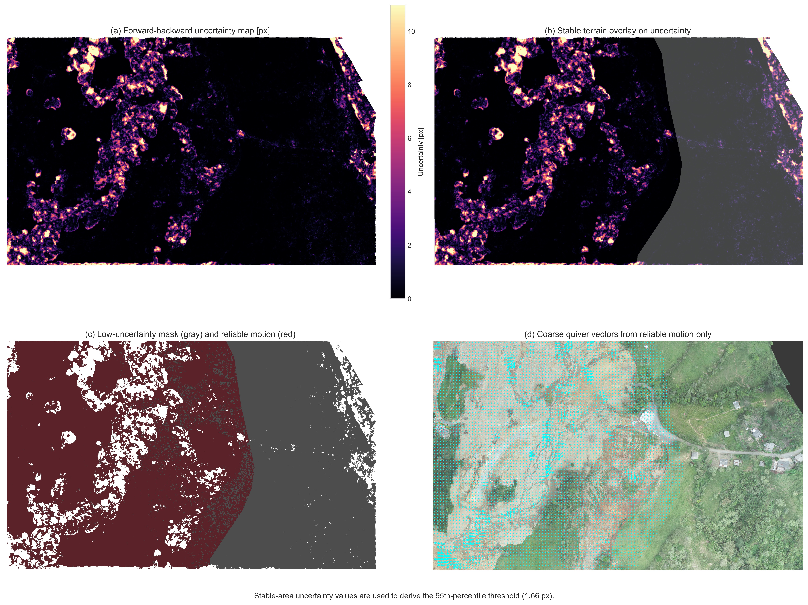
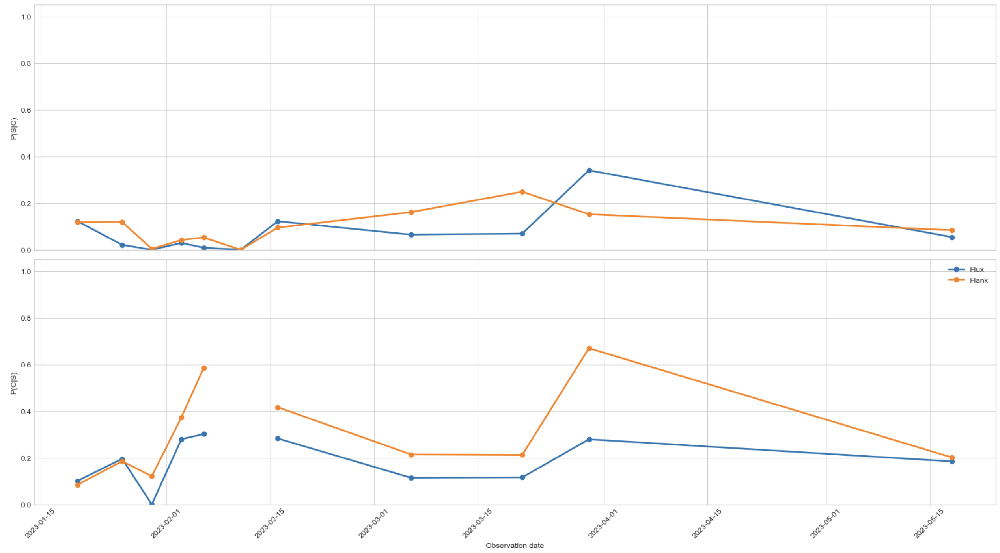
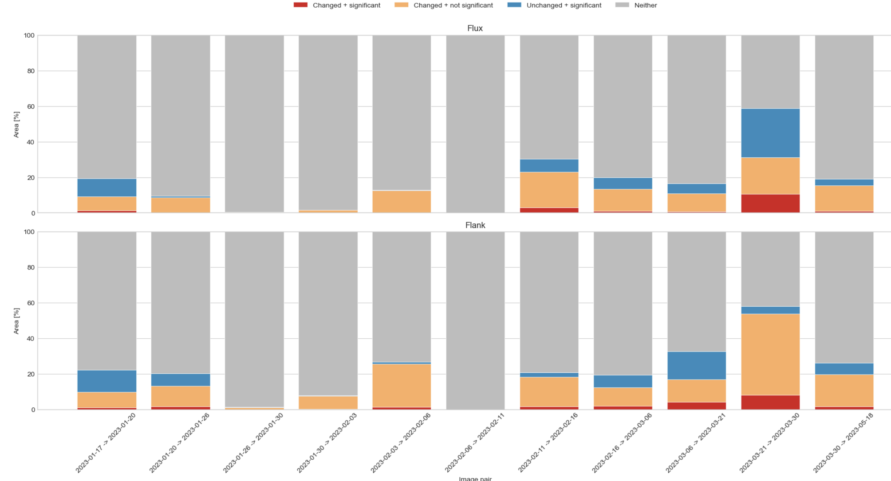
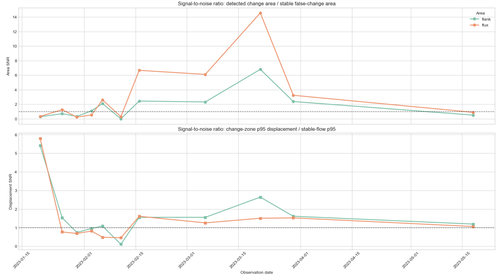
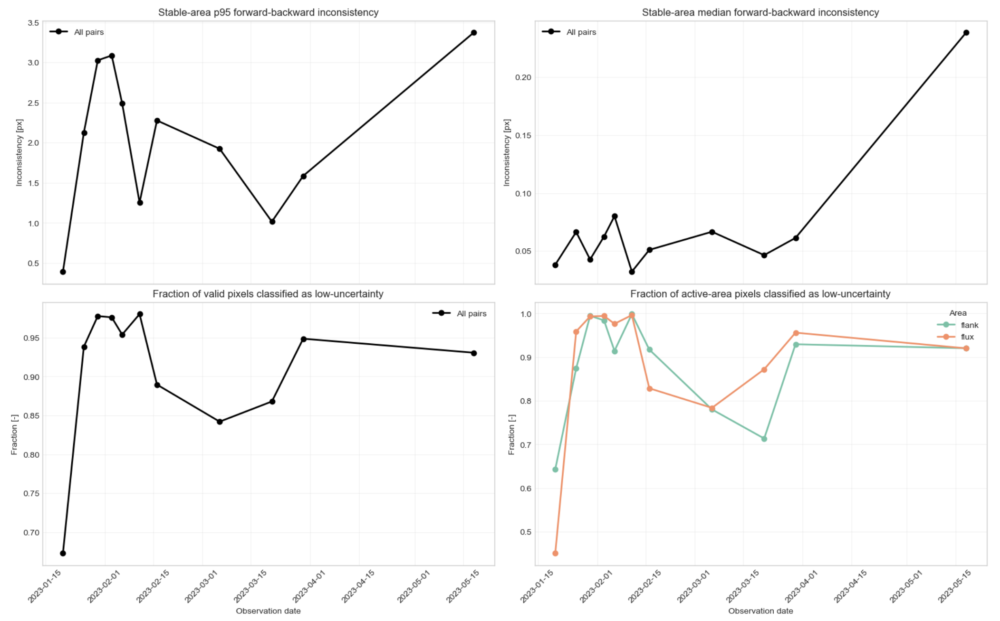
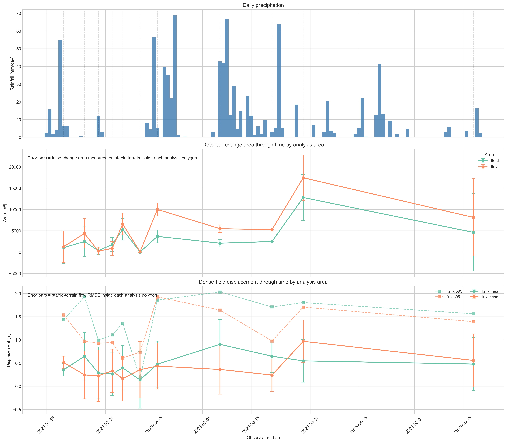
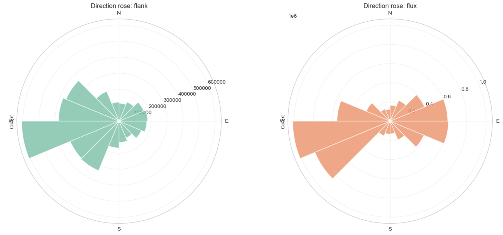
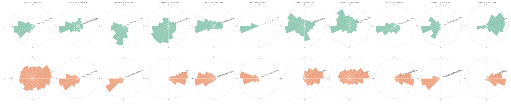

.

## 1. Introduction

Landslides are among the most destructive geomorphic hazards in mountainous regions, where steep slopes, intense rainfall, and weak or highly weathered materials interact to produce rapid landscape change. In this context, unmanned aerial vehicle (UAV) photogrammetry has become a valuable tool for landslide monitoring because it allows the generation of high-resolution multi-temporal orthophotos and surface models at short time intervals. 
The Rosas landslide in Cauca, Colombia, provides a particularly relevant case study: the main failure occurred on 9 January 2023 in the upper basin of Chontaduro Creek, affected several local communities, and damaged a section of the Pan-American Highway. Subsequent surveys recorded a rapid expansion of the affected area during the days following the event.

Although multi-temporal UAV products provide very detailed information, comparing images from different dates is not straightforward. Small geometric mismatches, radiometric differences, and local artifacts may be misinterpreted as terrain change, especially in large and complex landslides. In Rosas, different sectors of the landslide exhibit contrasting behaviors, including rotational movement near the crown, translational motion along the flanks, and more flow-like behavior toward the lower part of the mass movement. These differences make the site suitable for testing computer-vision-based methods under distinct deformation conditions.

This study uses 12 orthophotos derived from aligned drone point clouds to evaluate two image-based products implemented with OpenCV: a binary change mask and a dense displacement field. Two contiguous analysis areas were selected to compare algorithm performance under contrasting kinematic conditions. The first area corresponds to a rapidly evolving debris-flow-like sector, whereas the second is located on the eastern flank of the landslide and shows slower, smaller-magnitude deformation that is more consistent with translational movement. By comparing both areas, the study aims to assess how deformation style affects the reliability and sensitivity of each method.

*This internship was supervised by Prof. Dr. Bodo Bookhagen.*

## 2. Objectives

### 2.1. General objective

To evaluate the performance of OpenCV-based change detection and dense displacement estimation on multitemporal UAV orthophotos of the Rosas landslide, comparing their behavior in two contiguous sectors with contrasting deformation styles.

### 2.2. Specific objectives

- Define two representative analysis areas with different kinematic characteristics: a rapidly changing debris-flow-like sector and a slower eastern-flank sector with predominantly translational behavior.
- Generate, for each consecutive orthophoto pair, a binary change mask and a dense displacement field using OpenCV-based methods.
- Estimate empirical uncertainty from stable terrain in order to quantify false detections and residual motion.
- Compare the temporal and spatial behavior of both products in the two analysis areas and determine how deformation style influences their performance.

### 3. Study Area

The study area is located in the rural district of La Soledad, municipality of Rosas, Cauca, in southwestern Colombia ([Figure 1](#fig-study-area)). It lies within the upper basin of Chontaduro Creek, in the Patía Valley intermontane depression between the Western and Central Cordilleras of the Colombian Andes. The region is highly susceptible to landslides due to the combination of steep topography, intense rainfall, and soils and deposits derived from volcanic and volcaniclastic materials associated with the Sotará volcanic complex. Previous regional work by the Servicio Geológico Colombiano identified a long history of mass-movement activity in the municipality, highlighting the geomorphic instability of the area.

{: #fig-study-area }
*Figure 1. Shaded relief map of study area, showing major rivers, towns and a multi-temporal landslide inventory*

The Rosas landslide triggered in January 2023 is a complex mass movement ([Figure 2](#landslide-detail)). Previous descriptions indicate a rotational failure in the crown area, intense deformation and cracking in the central body, translational movement along the flanks, and earth- and debris-flow processes toward the toe, where material is funneled through lower-slope zones. This internal variability is important for the present study because it provides natural conditions for evaluating image-based methods in sectors with clearly different deformation dynamics.

{: #landslide-detail }
*Figure 2. Panoramic view of Rosas landslide*

For the purposes of this research, two contiguous sub-areas were selected from the orthophotos ([Figure 3](#study-areas)). The first corresponds to the more active and rapidly changing part of the landslide, where deformation is stronger and more diffuse, resembling debris-flow behavior. The second, is located on the eastern margin of the landslide and exhibits smaller, slower, and more spatially coherent displacements, more consistent with translational motion. The calculated area of the 'Flow area' covers approximately 5.83 ha and the 'Flank area' about 2.61 ha. The contrast between these two sectors provides the basis for assessing whether the tested algorithms perform equally well in high-activity and low-activity settings.

{: #study-areas }
*Figure 3. Sub-areas of study. The flow area (blue shadowed) and the flank of the landslide (purpule shadowed). The stable terrain used to fine-aligned the orthophotos is shown in stripped diagonal lines.*

## 4. Data

The dataset used in this study consists of the 12 orthophotos selected, derived from UAV point clouds acquired after the Rosas, Cauca landslide. These data span from 17 January 2023 to 18 May 2023 and include, for each survey date, the number of cameras, the size of the reconstructed point cloud, and the orthophoto resolution. This subset was chosen assuring all orthophotos cover the area selected for this study.

| Date       | Cameras | Points  | Orthophoto resolution (m) |
|------------|---------|---------|----------------------------|
| 1/17/2023  | 567     | 436,618 | 0.1                        |
| 1/20/2023  | 196     | 194,101 | 0.1                        |
| 1/26/2023  | 332     | 352,573 | 0.1                        |
| 1/30/2023  | 321     | 351,487 | 0.1                        |
| 2/3/2023   | 418     | 403.19  | 0.1                        |
| 2/6/2023   | 331     | 336,810 | 0.0643                     |
| 2/11/2023  | 576     | 627,729 | 0.1                        |
| 2/16/2023  | 329     | 346,862 | 0.0631                     |
| 3/6/2023   | 330     | 324,661 | 0.1                        |
| 3/21/2023  | 331     | 352.909 | 0.1                        |
| 3/30/2023  | 328     | 327,605 | 0.1                        |
| 5/18/2023  | 333     | 243,261 | 0.1                        |
{: #table1 }
*Table 1. UAV-derived orthophoto dataset used in this study for the study area, including acquisition date, number of cameras, point-cloud size, and orthophoto resolution for the surveys selected for the multitemporal analysis..*

## 5. Methodology

The orthophotos analyzed in this study were generated from UAV point clouds that had been previously processed and aligned through a Structure-from-Motion workflow (see the previous study [here](https://up-rs-esp.github.io/LinaMariaPerez_UAV_landslide/)). This earlier stage included image alignment in Agisoft Metashape, dense point cloud generation, selection of natural control points, GNSS surveying, chunk alignment, and additional refinement through stable-area registration and Iterative Closest Point (ICP) optimization. This previous co-registration stage provided the geometric basis for the orthophoto-based change analysis carried out here.

The methodological workflow developed in this study was designed to compare two computer-vision-based products derived from a multitemporal UAV orthophoto series: a binary change mask and a dense displacement field. The analysis was carried out using 12 orthophotos acquired after the Rosas landslide event, focusing on two contiguous sectors with contrasting deformation styles: a rapidly evolving debris-flow-like sector and a slower, more coherent eastern-flank sector. The workflow was organized into nine sequential stages: (1) image loading, (2) stable-area alignment, (3) common extent definition, (4) radiometric correction, (5) change detection, (6) dense displacement estimation, (7) uncertainty analysis, (8) temporal analysis by area, and (9) precipitation comparison. This general sequence is consistent with the need to first reduce geometric and radiometric inconsistencies before interpreting apparent surface change. The Rosas case and the earlier point-cloud alignment workflow are described on the project page. 

{: #metho }
*Figure 4. Methodological workflow adopted for the multitemporal orthophoto analysis, from image preparation and preprocessing to the generation of change and displacement products, uncertainty assessment, temporal analysis, and precipitation comparison.*

### 5.1. Fine Alignment of Images

Fine image alignment was necessary because even when orthophotos are derived from previously aligned point clouds, small residual offsets between dates may remain. In a landslide study, these residual misalignments can produce false change patterns that are unrelated to true terrain deformation. For this reason, an additional image-based alignment step was applied before any change analysis.

The alignment was performed using only stable terrain rather than the entire image ([Figure 3](#study-areas)). This decision is essential in an active landslide because the unstable area undergoes real deformation between dates and therefore should not control the geometric transformation. If the full image were used, the matching process could be biased by moving terrain and the alignment would partially absorb real landslide motion into the geometric correction. The stable area was defined based on field observations and geomorphological constrains. 

In practical terms, local features were detected within the stable mask using the *Scale-Invariant Feature Transform*, implemented in [OpenCV](https://docs.opencv.org/4.x/d0/de3/citelist.html#CITEREF_lowe04) through the **SIFT** class. **SIFT** identifies distinctive image structures and computes descriptors that can be matched between dates ([Figure 5](#keypoints)). After descriptor matching, a planar transformation was estimated with **findHomography**, using the RANSAC option to reduce the influence of mismatched correspondences. In OpenCV, findHomography computes a perspective transformation between two planes, while RANSAC retains only geometrically consistent matches as inliers (See OpenCV [Documentation](https://docs.opencv.org/4.x/dc/dc3/tutorial_py_matcher.html?utm_source=chatgpt.com)).

{: #keypoints }
*Figure 5. SIFT Keypoints detected between two images. Circles represent the scale at which the keypoint wast detected and the lines represent the orientation.*

After estimating the homography, the target image was warped onto the reference geometry. OpenCV’s geometric transformation routines operate by remapping the pixel grid of one image into the coordinate system of another, which is the basis for the corrected alignment.
Alignment quality was evaluated by comparing the absolute grayscale residuals over stable terrain before and after alignment ([Figure 6](#residuals)). This check is summarized through the mean absolute error over stable pixels, so that a successful alignment is indicated by a reduction in residual difference after warping (see the [notebook](https://github.com/LinMaria/Landslide_FeatureTracking/blob/main/Notebooks/Intership2.ipynb)). This evaluation is particularly useful because it provides a direct measure of whether the fine alignment step actually improved comparability between dates.

{: #residuals }
*Figure 6. Absolute grayscale difference before and after alignment for a single pair of images.*

### 5.2. Pre-Processing

Once the images were finely aligned, a preprocessing stage was applied to ensure that only comparable pixels were analyzed. First, the valid overlap between the reference and aligned target image was identified, and the analysis was restricted to the common image extent. This step is necessary because small differences in coverage and warping can leave margins where one image contains data and the other does not. The stable mask was also resized when necessary to match the raster dimensions of the images used in each pair. In OpenCV, image resizing can be performed with different interpolation schemes; nearest-neighbor interpolation is appropriate for masks because it preserves discrete classes without introducing mixed values.

After defining the common extent, the target image was radiometrically harmonized with the reference image through histogram matching (reference). The purpose of this step was to reduce differences caused by illumination changes, exposure variability, and acquisition conditions between dates. In multitemporal orthophoto analysis, such radiometric inconsistencies can generate false detections if the comparison is based directly on pixel values. Therefore, histogram matching (reference) was applied before both the binary change detection and dense displacement estimation, so that the measured signal would be more closely related to surface change than to brightness differences ([Figure 7](#histograms)).

{: #histograms }
*Figure 7. Pre and post histogram matching of a single image.*

### 5.3. Change Detection

The first analysis product was a *binary change mask* representing areas where the image content changed substantially between two consecutive dates. The procedure began by converting the orthophotos to grayscale using `cv2.cvtColor`(See function [here](https://docs.opencv.org/3.4/de/d25/imgproc_color_conversions.html?)), so that the comparison was performed on a single intensity field instead of three color channels. This simplifies the analysis and reduces sensitivity to inter-date chromatic variability, while preserving the luminance structure needed for pixel-wise comparison.

Before differencing, the grayscale images were smoothed with a Gaussian filter using `cv2.GaussianBlur`(See function [here](https://docs.opencv.org/3.4/d4/d86/group__imgproc__filter.html#gaabe8c836e97159a9193fb0b11ac52cf1)). Gaussian smoothing is used to suppress fine-scale structures and noise without introducing new structures at coarser scales. In practical terms, Gaussian smoothing acts as a low-pass filter: each pixel is replaced by a weighted average of its neighbors, with weights decreasing according to a Gaussian function. This reduces high-frequency texture and small radiometric fluctuations that could otherwise produce unstable or fragmented difference patterns after subtraction ([Lindeberg, T. (1994)](https://www.diva-portal.org/smash/get/diva2%3A457189/FULLTEXT01.pdf?)). In OpenCV, GaussianBlur implements this operation directly by convolving the image with a Gaussian kernel of chosen size and standard deviation.

After smoothing, the absolute grayscale difference between the two dates was computed with `cv2.absdiff`(See function [here](https://docs.opencv.org/3.4/d2/de8/group__core__array.html#ga6fef31bc8c4071cbc114a758a2b79c14)). This operation produces a difference image in which each output pixel is the absolute value of the difference between the two corresponding input pixels. Conceptually, this is one of the most classical forms of unsupervised change detection: areas with low absolute difference are interpreted as unchanged, whereas high values indicate a greater probability of meaningful surface modification. Image differencing remains one of the standard pixel-based approaches in remote-sensing change detection because of its simplicity and its direct relation to radiometric change between dates ([Hussain, M. et al. (2013)](https://www.sciencedirect.com/science/article/abs/pii/S0924271613000804?)).

The resulting difference image was then thresholded to separate changed from unchanged pixels, using `cv2.threshold`(See function [here](https://docs.opencv.org/3.4/d7/d1b/group__imgproc__misc.html#gae8a4a146d1ca78c626a53577199e9c57)). Thresholding converts a continuous-valued difference image into a binary map by assigning pixels above a given cutoff to the “change” class and those below it to the “no-change” class. This step is a binary decision rule applied to the difference distribution, and its performance depends strongly on the selected threshold. Because the grayscale values are in the 0-255 range, a threshold of 30 is a moderate cutoff: high enough to ignore small lighting/texture noise, but low enough to still catch visible terrain changes.

The preliminary binary result was then refined through morphological processing, using `cv2.morphologyEx` together with a structuring element that can be defined, for example, with `cv2.getStructuringElement`. This step is grounded in mathematical morphology, where binary objects are analyzed and transformed according to their shape. In this framework, opening is defined as erosion followed by dilation and is useful for removing small isolated foreground patches, while closing is dilation followed by erosion and is useful for filling small holes and improving spatial continuity. Applied to the thresholded difference image, these operators reduce salt-and-pepper noise, connect fragmented changed patches, and produce a more spatially coherent representation of the affected area (see documentation [here](https://docs.opencv.org/4.x/d9/d61/tutorial_py_morphological_ops.html)).

Finnaly, the binary mask was further refined by area filtering, so that very small connected patches interpreted as residual noise were removed from the final result using `cv2.findContours`. This stage is conceptually important because thresholding and morphology alone may still leave tiny detections caused by residual registration error, local illumination mismatch, or texture effects ([Figure 8](#changemask)).

{: #changemask }
*Figure 8. Example of the binary change-detection workflow for one image pair: (left) reference orthophoto, (middle) absolute grayscale difference after alignment and radiometric harmonization, and (right) final binary change mask overlaid on the reference image after thresholding and morphological filtering.*

### 5.4. Dense Displacement Field

The second analysis product was a **dense displacement field** estimated by optical flow (see [OpenCV documentation](https://docs.opencv.org/4.x/d4/dee/tutorial_optical_flow.html)). Optical flow aims to recover the apparent motion of image brightness patterns between two dates, so that each pixel is assigned a two-dimensional displacement vector. In contrast to binary change detection, which only identifies whether a location changed or not, dense optical flow provides continuous kinematic information, allowing the estimation of both the magnitude and direction of apparent surface movement. In the classical optical-flow formulation, motion estimation is based on the **brightness constancy assumption**, which states that the intensity of a moving image pattern remains approximately constant between two observations, and on an additional spatial regularity assumption, since the motion cannot be solved uniquely from a single pixel alone ([Horn, B. K. P., & Schunck, B. G. (1981)](https://www.sciencedirect.com/science/article/pii/0004370281900242?)).

In this study, dense motion was estimated with the **Farnebäck algorithm**, implemented in OpenCV through `cv2.calcOpticalFlowFarneback` (see documentation [here](https://docs.opencv.org/4.x/d4/dee/tutorial_optical_flow.html?)). This method was selected because it computes motion densely over the full image domain rather than only at sparse feature locations, which makes it suitable for mapping spatially continuous deformation patterns on the orthophotos. The theoretical basis of the method is the approximation of local image neighborhoods by **quadratic polynomials**; if a neighborhood undergoes a translation between two images, the polynomial coefficients change in a predictable way, and this relationship can be used to estimate the local displacement field. [Farnebäck, G. (2003)](https://www.diva-portal.org/smash/get/diva2%3A273847/FULLTEXT01.pdf?) further refines these estimates over neighborhoods and across scales, which improves robustness in the presence of noise and spatially variable motion. OpenCV describes `calcOpticalFlowFarneback` as a function that computes a dense flow field in which each pixel in the first image is associated with a displacement vector toward its corresponding position in the second image.

The function was applied to the consecutive aligned corrected grayscale orthophotos pairs (see one exxample in [Figure 9](#opticalflow)), so that the estimated motion would reflect terrain changes rather than geometric or illumination inconsistencies. The resulting flow fields contains two components at each pixel: a horizontal displacement component (u) and a vertical displacement component (v), both expressed in pixel units. In OpenCV-based workflows, the conversion from Cartesian flow components to **magnitude** and **direction** can be done either analytically using the Euclidean norm and `arctan2`, or directly with `cv2.cartToPolar`, which computes vector magnitude and angle for every pixel (see documentation [here](https://docs.opencv.org/4.x/d2/de8/group__core__array.html?)).

{: #opticalflow }
*Figure 9. Low-uncertainty dense-displacement products for a representative orthophoto pair. (upper left) Displacement magnitude after uncertainty filtering. (upper right) Displacement direction derived from the horizontal and vertical flow components. (lower left) Coarse quiver vectors summarizing the reliable motion field. (lower right) Direction map overlaid on the grayscale orthophoto for spatial interpretation of the estimated movement patterns.*

In this study displacement magnitude was derived as the Euclidean norm of the two flow components, whereas direction was derived from the arctangent of the vertical and horizontal components and then expressed in degrees. The pixel-based displacement estimates were additionally converted to metric units using the orthophoto ground sampling distance (see [Table 1](#table1)), making it possible to interpret the motion field in terms of approximate ground displacement.

A useful distinction to state explicitly is that the two products address different aspects of landslide dynamics. The **change mask** is binary and extent-oriented: it indicates where significant change likely occurred. The **dense displacement field** is continuous and kinematics-oriented: it indicates how the surface texture appears to move within those changing zones. Used together, both products provide complementary information on landslide activity, since one describes the spatial footprint of change and the other describes its apparent motion pattern. 

### 5.5. Uncertainty Estimation

Uncertainty estimation was included to distinguish plausible landslide-related signals from artifacts introduced by residual misregistration, radiometric differences, interpolation effects, and optical-flow instability. In image-based displacement analysis, this step is especially important because the estimated motion field is affected not only by real terrain displacement, but also by the assumptions of optical flow itself, including brightness constancy and spatial smoothness. Classical optical-flow theory shows that motion cannot be recovered independently at each pixel without additional assumptions, and modern reviews continue to treat uncertainty and consistency checks as essential parts of flow interpretation ([Horn, B. K. P., & Schunck, B. G. (1981)](https://www.sciencedirect.com/science/article/pii/0004370281900242?)).

Because no external ground-truth displacement field was available for each image pair, uncertainty was estimated empirically from the defined **stable terrain**, where true motion is assumed to be negligible over the interval between orthophotos. This logic is widely used in geospatial change analysis: stable surrounding terrain provides a practical estimate of the background error level against which motion inside the active area can be compared. In recent landslide and topographic monitoring studies, displacement or elevation residuals measured over stable terrain are explicitly used as indicators of uncertainty and precision ([Mueting, A., et al. (2024)](https://esurf.copernicus.org/articles/12/1121/2024/esurf-12-1121-2024.pdf?))

For the **binary change mask**, uncertainty was quantified as the area falsely classified as change inside the stable mask. This is computed as the number of stable pixels with non-zero change multiplied by pixel area, together with the corresponding false-positive rate relative to the stable valid area. Then, if the detected change within the unstable area is of the same order as the false change observed over stable ground, that result should be interpreted cautiously. These indicators are computed pairwise.

For the **dense displacement field**, uncertainty was evaluated from residual motion over stable terrain and from a pointwise **forward–backward consistency** check. The dense flow itself was computed in both temporal directions using Farnebäck optical flow, via `cv2.calcOpticalFlowFarneback`, which in OpenCV returns a dense vector field where each pixel in the first image is assigned a displacement vector toward its corresponding position in the second image. This estimation comes from Farnebäck’s polynomial-expansion approach, in which local image neighborhoods are approximated by quadratic polynomials and the displacement is inferred from how those polynomial coefficients change under translation ([Farnebäck, G. (2003)](https://www.diva-portal.org/smash/get/diva2%3A273847/FULLTEXT01.pdf)).

The forward–backward consistency principle was then used to assess local reliability. The idea is simple: if the forward flow from image (A) to image (B) is correct, then the backward flow from (B) to (A), evaluated at the forward-mapped position, should approximately reverse it. Thus, a reliable pixel should satisfy:

$$
\mathbf{f}(x) + \mathbf{b}(x + \mathbf{f}(x)) \approx 0
$$

where $\mathbf{f}$ is the forward flow and $\mathbf{b}$ is the backward flow. Large disagreement indicates unstable matching. The backward flow is sampled at the forward-displaced coordinates using `cv2.remap`, which applies a geometric mapping with interpolation for non-integer locations. Bidirectional consistency is widely recognized in the optical-flow literature as a practical way to test flow coherence and identify unreliable estimates (See OpenCV [documentation](https://docs.opencv.org/trunk/d1/da0/tutorial_remap.html)).

An **empirical uncertainty threshold** is derived from stable terrain by taking the 95th percentile of the forward–backward inconsistency values measured over stable valid pixels. Pixels below that threshold are classified as **low uncertainty**. This is used as a ***low_uncertainty_mask*** defined over valid pixels with finite uncertainty values not exceeding the stable-area 95th percentile. A more restrictive ***reliable_motion_mask*** is then created by additionally excluding stable terrain and requiring a minimum flow magnitude greater than 0.25 pixels, so that only non-stable, sufficiently strong, and low-uncertainty vectors are retained for interpretation. This reduces the influence of weak or noisy vectors.

In addition to the pointwise filtering, **coarse uncertainty-aware layers** is build for visualization and spatial interpretation. This is done with a block-based aggregation function (`build_coarse_field`) that divides the image into regular windows and computes the **median** horizontal component, vertical component, and uncertainty of the reliable vectors inside each block. In the illustrated implementation, a coarse step of 40 pixels is used, with a minimum number of reliable samples required per block before aggregation. The coarse products include: (i) coarse displacement magnitude, (ii) coarse movement direction, (iii) quiver vectors summarizing the dominant reliable motion in each block, and (iv) overlays of these products on the grayscale or RGB orthophoto context ([Figure 9](#opticalflow)). This aggregation does not change the raw dense-flow computation; rather, it converts the filtered dense field into a more interpretable mesoscale representation, suppressing pixel-scale scatter while preserving the dominant spatial pattern of reliable motion. 

Finally, uncertainty over stable terrain was summarized statistically through metrics such as RMSE, median displacement, and the 95th percentile of displacement magnitude. These statistics serve as reference levels for interpreting the active sectors: estimated displacement in the flux or flank areas becomes more credible when it is clearly larger than the residual motion measured over stable terrain. In this sense, the uncertainty framework supports both **quality control** and **comparative interpretation**, allowing the two sectors to be evaluated not only by the size of their signal but also by how strongly that signal rises above the local noise floor. 

{: #uncertainty}
*Figure 10. Example of the uncertainty-estimation workflow for a representative orthophoto pair. **(a)** Forward–backward flow inconsistency, used as a pointwise uncertainty indicator. **(b)** Stable terrain used to characterize the background uncertainty distribution and define the 95th-percentile threshold. **(c)** Reliable-motion mask obtained after retaining only low-uncertainty, non-stable pixels. **(d)** Coarse aggregated displacement product derived from the filtered vectors for spatial interpretation.*

In order to distinguish meaningful motion from background residual displacement, a pair-specific significance threshold was derived from stable terrain. For each orthophoto pair, displacement magnitude was evaluated over stable and valid pixels, and the 95th percentile of that distribution was used as the threshold for significant displacement. A pixel was considered to exhibit significant displacement only if it belonged to the reliable-motion set after uncertainty filtering and if its displacement magnitude exceeded the stable-terrain 95th percentile for that image pair. This definition makes the displacement criterion adaptive to the noise level of each comparison.

### 5.6. Temporal and Spatial Analysis

After pairwise products were generated, the results were summarized separately for the two analysis areas through time. For each consecutive orthophoto pair and for each polygon, the workflow extracted metrics such as detected change area, false-change area over stable terrain, mean displacement magnitude, high-percentile displacement, and mean movement direction in the detected change zone. These summaries allowed the temporal evolution of both sectors to be compared directly.

Special attention was given to the contrast between the flank and flux sectors. Because these two areas represent different deformation styles, their comparison is central to the methodological objective of evaluating algorithm performance under different kinematic conditions. The expectation is that the debris-flow-like sector should show larger and more variable signals, while the eastern flank should exhibit smaller, more coherent, and slower changes.

Direction was analyzed through time using time-series plots and direction histograms. These products help assess whether the estimated motion remains spatially and temporally coherent or whether it is highly scattered, which could indicate weak signal or algorithmic instability. In addition, spatial aggregation through time was used to derive recurrence maps, mean displacement maps, and temporal variability maps. Recurrence maps show how often a pixel was detected as changed across all consecutive pairs, mean displacement maps summarize the average magnitude of estimated motion, and variability maps show how stable or intermittent that motion was over time.

To compare the binary change-detection product with the dense displacement field, the latter was converted into a binary significant-displacement mask using the uncertainty-based threshold described in Section 5.5. Thus, for each image pair and for each analysis area, two binary products were available: the change mask $\mathbf{C(x)}$ and the significant-displacement mask $\mathbf{S(x)}$. These masks were compared pixel by pixel in order to identify areas where both methods agreed and areas where they differed.

The comparison was summarized using four pixel classes: (i) pixels classified as changed and showing significant displacement *((C=1, D=1))*, (ii) pixels classified as changed but not showing significant displacement *((C=1, D=0))*, (iii) pixels not classified as changed but showing significant displacement *((C=0, D=1))*, and (iv) pixels classified as neither changed nor significantly displaced *((C=0, D=0))*. These classes were used to evaluate whether radiometric or textural change identified by the binary mask was accompanied by measurable motion in the dense displacement field.

Agreement between both products was quantified using conditional overlap metrics and a symmetric overlap index. The fraction of changed pixels that also showed significant displacement was computed as $\mathbf{(P(D \mid C))}$, while the fraction of significant-displacement pixels that were also classified as changed was computed as $\mathbf{(P(C \mid D))}$:

$$
\mathbf{P(D \mid C)} = \mathbf{\frac{|C \cap D|}{|C|}}
$$

$$
\mathbf{P(C \mid D)} =\mathbf{\frac{|C \cap D|}{|D|}}
$$

### 5.7. Rainfall Analysis

To support interpretation of the image-based results, precipitation data were incorporated as an external temporal control. On the Rosas project page, rainfall for the study area is described using data from the Párraga meteorological station managed by IDEAM, including daily precipitation and accumulated rainfall preceding the January 2023 event. The same logic is appropriate here: rainfall is not used to derive displacement directly, but to help interpret whether periods of increased image-based activity coincide with wet conditions or with cumulative antecedent rainfall.

The rainfall analysis should therefore include daily precipitation, cumulative rainfall between image dates, and an antecedent rainfall metric such as 7-day accumulation. Daily rainfall provides short-term forcing, cumulative rainfall between image dates relates directly to the image comparison interval, and antecedent rainfall helps account for progressive saturation effects that may influence landslide reactivation. This is especially relevant in complex landslides, where deformation may continue or intensify after rainfall due to delayed hydrological response.

## 6. Results

### 6.1 Change Detection Results vs. Dense Displacement Results

As shown in [Figure 11](#seriespslc) (top), the overall values of $\mathbf{P(D \mid C)}$ remain below 0.5. This indicates that, in most image pairs, fewer than half of the pixels classified as change also exhibited significant displacement. The first six dates, in particular, show especially low overlap values. This pattern is consistent with the results in [Figure 12](#chavsdis), where these same dates are characterized by generally small areas of both detected change and significant displacement, and especially by very small values of class *i* (in red: pixels classified as changed and showing significant displacement).

Overall, these results suggest that the change-detection algorithm has limited ability to isolate physically meaningful change in the early image pairs and, in several cases, appears to confuse shadow variations with actual terrain change. As illustrated in [Figure 12](#chavsdis), the first six dates show only a small number of pixels classified as having significant displacement (blue and red classes). However, for the pair 2023-02-03 to 2023-02-06, there is a noticeable increase in the area classified as changed without significant displacement. This pattern is consistent with false detections caused by shadow changes or illumination differences rather than by real surface motion. In contrast, the dense displacement algorithm performed more robustly in this case, as it did not indicate significant movement where no meaningful displacement was present.

{: #seriespslc}
*Figure 11. Time series of the conditional overlap metrics (P(D \mid C)) and (P(C \mid D)) in the flank and flux sectors.*

Regarding $\mathbf{P(C \mid D)}$, the first six image pairs exhibit low values, reflecting the small number of pixels with significant displacement during this period. For the later dates, when the area affected by significant movement increased, $\mathbf{P(C \mid D)}$ also increased, indicating that more of the significantly displaced pixels were simultaneously identified as changed. Nevertheless, the values remained mostly below 0.5, which points to a generally low spatial correspondence between the change-detection and dense-displacement results. The only clear exception is the second-to-last image pair, where the correlation becomes comparatively high. This is also evident in [Figure 12](#chavsdis), where a large proportion of pixels were classified both as changed and as presenting significant displacement. This agreement is especially marked in the flank zone, where both methods appear to capture the same active pattern more consistently.

{: #chavsdis}
*Figure 12. Pairwise composition of the four agreement classes between the binary change mask and the significant-displacement mask in the flank and flux areas. The bars show the proportion of pixels classified as (i) changed and significantly displaced, (ii) changed but not significantly displaced, (iii) unchanged but significantly displaced, and (iv) neither changed nor significantly displaced.*

When comparing the two analysis areas, only one consistent pattern clearly stands out. The correlation between pixels with significant displacement that were also classified as changed, $\mathbf{P(C \mid D)}$, was systematically higher in the flank than in the flux area ([Figure 11](#seriespslc)). This suggests that, in the flank zone, the two methods were more likely to identify the same pixels as active.

A likely explanation is the different spatial character of deformation in the two sectors. In the flank area, both the change mask and the dense displacement field tend to be concentrated in more coherent and spatially confined regions. In contrast, in the flux area, the pixels identified by both methods appear more scattered and diffuse. This difference can be seen, for example, in [Figure 13](#scatteredflux), where the detected activity in the flux sector is spatially dispersed rather than concentrated in a well-defined pattern.

{: #scatteredflux}
*Figure 13. Example of the spatial comparison between binary change detection and dense displacement for a representative image pair. The panels show the binary change mask, coarse displacement magnitude, coarse displacement direction, and quiver vectors, illustrating the contrast between the extent of detected change and the spatial structure of the estimated motion field.*

### 6.3. Uncertanty

The uncertainty analysis was evaluated using two complementary approaches. First, both products were assessed relative to the stable area, which served as an empirical reference for background error. Second, for the dense displacement field, uncertainty was further evaluated through a forward–backward consistency analysis. As shown in [Figure 14](#noisetoratio) (top), the signal-to-noise ratio (SNR) of the change mask remains close to 1 during the first six image pairs, indicating high uncertainty in the pixels classified as changed during this period. In practical terms, values near 1 mean that the amount of detected change in the active area is similar to the amount of false change measured in the stable area, so the signal cannot be clearly distinguished from the background noise. This is consistent with the overall behavior of the series, since the first six dates appear to exhibit less movement than the later image pairs. For the last five pairs, the SNR generally increases, indicating that the detected change becomes more clearly distinguishable from the stable-area reference, although the final pair again shows elevated uncertainty.

In contrast, [Figure 14](#noisetoratio) (bottom) presents a measure of motion strength relative to residual displacement in stable terrain, based on the ratio between the 95th percentile displacement in the change zone and the 95th percentile displacement over the stable area. This plot shows that, from the second to the fifth image pair, the displacement field is relatively noisy, with values close to or only slightly above 1. This again agrees with the general observation that little movement was detected during those dates. For the remaining pairs, the ratio is generally above 1, which indicates that the upper range of motion in the active areas exceeds the stable-area residual motion. However, the values are still not consistently high, suggesting that the displacement estimates remain affected by a non-negligible level of noise relative to the stable reference. With respect to the two analysis areas, no clear systematic difference is observed between the flux and the flank. In some image pairs one area appears less uncertain, whereas in others the opposite occurs, so neither sector shows consistently lower uncertainty throughout the series.

{: #noisetoratio}
*Figure 14. Pairwise signal-to-noise ratios for the change-detection and dense-displacement products. Top: ratio between detected change area and stable-area false change area. Bottom: ratio between the 95th percentile displacement magnitude in the changed zone and the 95th percentile displacement magnitude over stable terrain. Values above 1 indicate that the detected signal exceeds the background level measured in stable terrain.*

Regarding the forward–backward analysis, [Figure 15](#uncertres) (top left and top right) shows that, for most image pairs, the 95th percentile of forward–backward inconsistency in the stable area is well above zero, indicating that a subset of stable pixels exhibits relatively high uncertainty. In contrast, the median inconsistency remains much lower for most dates, which suggests that the majority of stable pixels are characterized by low uncertainty, while the high values in the 95th percentile are driven by a smaller proportion of problematic pixels. This pattern is consistent with localized errors rather than with a uniformly poor displacement field. One likely explanation is that image deformation near the external borders, where geometric distortions and resampling effects are stronger, is being erroneously interpreted by the model as movement. The median values are mostly below 1 px, which can be considered relatively low inconsistency given that the ideal value on stable terrain would be zero. The main exception is the last pair of dates, which shows elevated inconsistency in both the 95th percentile and the median, indicating a more generalized decrease in flow reliability for that pair.

As for the bottom left and bottom right panels in [Figure 15](#uncertres), these plots show the fraction of pixels classified as low-uncertainty after the forward–backward filtering. The lower left panel summarizes this fraction over all valid pixels, whereas the lower right panel shows the same metric separately for the two analysis areas. In general, all image pairs remain above 70%, and most are above 85%, except for the first pair, which presents a lower proportion of low-uncertainty pixels. This indicates that, despite the elevated upper-tail inconsistency observed in some dates, most pixels are still retained as reliable after filtering. With respect to the two analysis areas, the flux behaves as well as or slightly better than the flank in seven of the eleven image pairs, showing a greater proportion of low-uncertainty pixels during those dates.

{: #uncertres}
*Figure 15. Pairwise uncertainty summary for the dense displacement field based on forward–backward consistency, including stable-area inconsistency metrics and the fraction of pixels retained as low-uncertainty in the full valid domain and in the active analysis areas.*

### 6.3. Temporal Behavior

Yes — here is a cleaner version with fewer references to the figure:

The time-series results in [Figure 16](#timeseries) indicate that the two study areas share a broadly similar temporal pattern during the first six image pairs, but then show a different behavior in the last five pairs. During the first six comparisons, both the flank and the flux exhibit low values of detected change area and low mean displacement, suggesting that activity during this initial period was generally weak. However, the 95th percentile of the displacement field shows marked peaks in the flank for the pairs 2023-01-20 to 2023-01-26 and 2023-02-03 to 2023-02-06. Examination of the spatial distribution of these high-magnitude vectors suggests that they correspond to very localized zones of deformation rather than to widespread movement across the full area. Thus, although the mean signal remains low during this first period, the p95 values indicate that small sectors may still have experienced concentrated displacement. Overall, however, both the detected change area and the average displacement remain low during these first six pairs, and in some dates they are close to zero.

A different behavior emerges in the second part of the series, beginning with the pair 2023-02-26 to 2023-03-06. During this interval, both the detected change area and the displacement field exhibit a clear peak. This may reflect a genuine increase in slope movement, but it may also be influenced by the longer time interval between the two dates, since a greater (\Delta t) allows more displacement to accumulate and may therefore produce larger measured changes. The following image pairs also span relatively long intervals, which could likewise contribute to higher apparent displacement and larger detected change areas. Even so, a particularly clear increase is observed in the flux area between 2023-03-21 and 2023-03-30, where both the change mask and the displacement field indicate stronger activity. Inspection of the corresponding images confirms that this period was associated with substantial movement in both the flank and the flux sectors. The final image pair should be interpreted more cautiously, since it presents high uncertainty in most metrics. This elevated uncertainty may also be related to the longer temporal gap between the two acquisitions.

With respect to precipitation, the relationship between rainfall and slope activity is not straightforward. In general, the rainfall pattern cannot be linked directly and consistently to the observed movement in the two study areas. The clearest possible association is the final major peak of activity between 2023-03-21 and 2023-03-30, which was preceded by approximately one month with many consecutive rainy days. This suggests that antecedent rainfall may have contributed to the increase in movement during that period, although the available results do not support a simple one-to-one correspondence between rainfall peaks and displacement peaks throughout the full series.

{: #timeseries}
*Figure 16. Time-series comparison of rainfall and landslide activity indicators in the flux and flank sectors. The panels show precipitation, detected change area, and displacement magnitude statistics (mean and 95th percentile) derived from the dense displacement field.*

Regarding movement direction, [Figure 17](#directionhist) shows that the flank presents a consistent dominant orientation toward the **west-southwest (WSW)**. This pattern is geomorphologically plausible, since the slope in that sector faces approximately the same direction, and the displacement vectors would therefore be expected to contain a strong westward component. By contrast, the flux area also shows an overall tendency toward the west, but with a second important component in the opposite direction, toward the east. Since the debris-flow path is directed mainly toward the south, a stronger southward to southwestward displacement would have been expected. However, the algorithm detects very little motion in the north-south direction. This suggests that the method may be capturing lateral changes associated with the wandering of the river-bed channels, while failing to resolve rapid motion in the main flow direction.

{: #directionhist}
*Figure 17. Direction histograms of the displacement vectors for the flank and flux sectors.*

The temporal evolution of movement direction, shown in [Figure 18](#direction), indicates that directionality becomes clearer during the periods of stronger displacement. When higher magnitudes are detected, the estimated vectors are concentrated within a narrower directional range, with less scatter toward other azimuths. This suggests that the algorithm identifies movement direction more consistently when the deformation signal is stronger, whereas periods of weak displacement are associated with noisier and more dispersed directional estimates.

{: #direction}
*Figure 18. Temporal evolution of displacement-vector direction in the flank and flux areas.*

### 6.3. Spatial Behavior

To analyze the spatial behavior of both the changed areas and the displacement field, the results were examined separately for the flank and flux sectors.

For the **flank area**, [Figure 19](#recurrence) (upper row) shows that the recurrence of changed pixels is concentrated mainly in the upper part of the slope, corresponding to the crown of the landslide. This pattern reflects the progressive retreat or advance of the crown, although it is also likely influenced by false detections related to shadows, to which the change-detection algorithm is particularly sensitive. In terms of displacement magnitude, a main zone of high values is concentrated downslope from the crown and corresponds to the body of the landslide developed in this sector. The temporal variability is also high in this same area, which is consistent with alternating periods of stronger and weaker activity through time. Thus, in the flank, the spatial coincidence between high mean displacement and high temporal variability highlights the sector where deformation was most persistent and dynamically variable.

{: #recurrence}
*Figure 19. Spatial summary of landslide activity in the flank and flux sectors. For each area, the figure shows change recurrence, mean displacement magnitude, and temporal variability of displacement, allowing comparison between the persistence, intensity, and temporal variability of the detected deformation patterns.*

In the **flux** sector, [Figure 19](#recurrence) (lower row) shows that recurrently changed pixels are concentrated mainly along the lateral margins of the flow path. This suggests that the binary change mask is particularly sensitive to repeated variations in the width and edges of the channelized zone. In contrast, the highest mean displacement magnitudes are concentrated within the active channel itself, where material transport appears to have been more intense during the observation period. The temporal variability map shows a similar concentration in this same area, supporting the interpretation that these zones correspond to the parts of the debris-flow system where movement was most active and variable through time.

## 7. Discussion & Conclusiones

- The behavior of the binary change-detection algorithm is consistent with the underlying method. Because the workflow is based on grayscale image differencing and thresholding, it is sensitive to radiometric variations between acquisition dates. In several pairs, cast shadows or illumination differences produced intensity changes large enough to be classified as terrain change, leading to false positives. At the same time, subtle but real deformation may remain below the detection threshold, especially where the surface texture is preserved. Thus, the binary mask should be interpreted as a map of significant appearance change rather than a direct measure of ground displacement.

- In summary, the uncertainty analysis indicates that the binary change mask is strongly affected by noise, especially during the early image pairs, and is therefore less reliable as a standalone indicator of landslide activity. By contrast, the dense displacement field provides a more robust signal, although it still contains localized areas of elevated uncertainty. The forward–backward consistency results further show that uncertainty is mainly concentrated in a limited subset of pixels rather than being generalized across the full image domain. After filtering, most valid and active-area pixels remain classified as low-uncertainty, supporting the use of the dense displacement field as the more reliable product for interpreting deformation patterns in this study.

- The temporal analysis indicates two main phases of behavior. During the first six image pairs, both the flank and the flux show generally low changed areas and low mean displacement, suggesting weak overall activity, although isolated peaks in the 95th percentile displacement reveal that localized deformation was still occurring in some dates, especially in the flank. In the second part of the series, both changed area and displacement increase more clearly, with a particularly marked peak toward late March. Part of this intensification may reflect genuinely stronger movement, although the longer time intervals between some image pairs probably also contributed by capturing greater accumulated displacement. Overall, the time series suggests a transition from an initial period of weak and localized activity to a later period of more extensive and stronger deformation, while the relation with rainfall remains suggestive rather than conclusive.

- The temporal analysis of movement direction shows that directional estimates become more coherent when displacement is stronger. In the flank, the dominant orientation remains relatively stable through time and is consistent with the west-southwest-facing slope, which supports the geomorphological plausibility of the dense-flow results in that sector. In contrast, the flux exhibits a more dispersed directional pattern, with both westward and eastward components and little expression of the expected southward flow direction. This suggests that the algorithm captures lateral shifts and surface-pattern changes better than rapid downslope transport in the main channel direction. Overall, the directional results are most reliable during the periods of higher displacement and in the flank area, whereas weaker-activity periods and the flux sector are more affected by directional scatter and ambiguity.

- The spatial analysis highlights clear differences between the two sectors. In the flank, recurrent change is concentrated near the crown, indicating repeated activity in the headscarp zone, while the highest mean displacement and temporal variability are concentrated in the landslide body, where movement was stronger but intermittent through time. In the flux, recurrent change is concentrated mainly along the channel margins, suggesting that the binary change mask is particularly sensitive to repeated variations in channel width and edge position. By contrast, the highest mean displacement and temporal variability are concentrated within the active channel itself, where material transport was more intense. Taken together, these spatial patterns show that the change mask and the dense displacement field emphasize different aspects of the process: the first highlights repeated surface modification, especially along boundaries, whereas the second better captures the zones of stronger and more dynamic movement.

- An additional limitation of the analysis is that both products remain sensitive to factors unrelated to true ground deformation. The binary change mask is particularly affected by illumination changes and vegetation variability, which can generate radiometric differences that are misinterpreted as surface change. The unequal temporal gaps between image dates also complicate interpretation, since longer intervals may accumulate more displacement and therefore produce stronger apparent signals that are not directly comparable with shorter intervals. Moreover, the dense displacement field represents **2D image-plane motion** rather than the full **3D movement of the slope**, so part of the real displacement may be underestimated or misrepresented depending on viewing geometry and terrain orientation. The results also depend strongly on image quality and on the accuracy of inter-date alignment, as residual distortions or local misregistrations can propagate into both the change mask and the optical-flow estimates. Finally, optical flow performs less reliably in texture-poor or visually homogeneous zones, where the lack of distinctive image patterns makes correspondence difficult and increases the likelihood of noisy or ambiguous motion estimates.

## References

- Lindeberg, T. (1994). Scale-space theory: A basic tool for analysing structures at different scales.
- Hussain, M. et al. (2013). Change detection from remotely sensed images: From pixel-based to object-based approaches.
- Horn, B. K. P., & Schunck, B. G. (1981). Determining Optical Flow.
- Farnebäck, G. (2003). *Two-Frame Motion Estimation Based on Polynomial Expansion*.
- Mueting, A., et al. (2024). *Tracking slow-moving landslides with PlanetScope data*.

---

**Related Links:**
- [Back to Projects]({{ '/my-projects/' | relative_url }})
- [Contact Me](mailto:lina.perez.garcia@fu-berlin.de)
